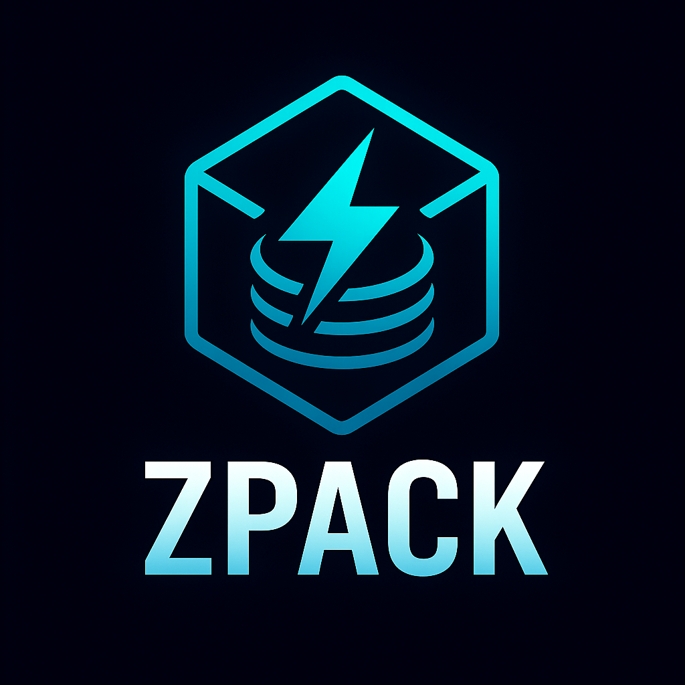

# zpack

<div align="center">

</div>

[](https://ziglang.org/)
[](https://ziglang.org/)
[](https://github.com/ghostkellz/zpack)
[](https://github.com/ghostkellz/zpack)

A fast compression library for Zig, providing multiple compression algorithms.

> **Current status:** `v0.3.0-rc.1` — stabilization pass for the 0.3 beta cycle.

## Features

- LZ77-based compression (fast, general-purpose)
- Run-Length Encoding (RLE) for repetitive data
- Streaming APIs with 64 KiB chunked pipelines
- Reference zlib bridge with bundled *miniz* or the system's `libz`
- Benchmark, fuzzing, and profiling executables behind build flags
- Production-oriented CLI with streaming, raw mode, and `--version`
- Comprehensive documentation ([DOCS.md](DOCS.md))

## What’s new in v0.3.0-rc.1

- Validated benchmark suite comparing LZ77/RLE against the zlib reference backend
- Fuzzing harness and profiler promoted to default developer builds
- Switched system `libz` integration to always link `libc`, resolving rare segfaults on Linux
- Documentation refreshed for streaming, troubleshooting, and semantic versioning

## Installation

Add zpack to your Zig project:

```bash
zig fetch --save https://github.com/ghostkellz/zpack/archive/refs/heads/main.tar.gz
```

This will add the dependency to your `build.zig.zon` file.

## Usage

```zig
const zpack = @import("zpack");

const compressed = try zpack.Compression.compress(allocator, input);
defer allocator.free(compressed);
const decompressed = try zpack.Compression.decompress(allocator, compressed);
defer allocator.free(decompressed);
```

## Algorithms

- `Compression`: LZ77-inspired fast compression
- `RLE`: Run-Length Encoding for data with long runs of identical bytes
- `zlib.reference`: Optional zlib-compatible codec (bundled *miniz* or system `libz`)

## Building

```bash
zig build
zig build run  # Run the example
zig build test # Run tests
zig build benchmark -Dbenchmarks=true       # Run performance suite
zig build fuzz -Dbenchmarks=true            # Execute fuzz harness
```

## CLI Tool

The library comes with a CLI tool for compressing and decompressing files.

```bash
zig build run -- compress <input_file> [output_file]
zig build run -- decompress <input_file> [output_file]
# Stream large files without buffering everything in memory
zig build run -- compress logs.txt logs.txt.zpack --stream --no-header

# Compare against the zlib reference implementation
zig build benchmark -Dbenchmarks=true -Duse_system_zlib=true
```

Example:
```bash
zig build run -- compress myfile.txt
zig build run -- decompress myfile.txt.zpack myfile.txt
```
